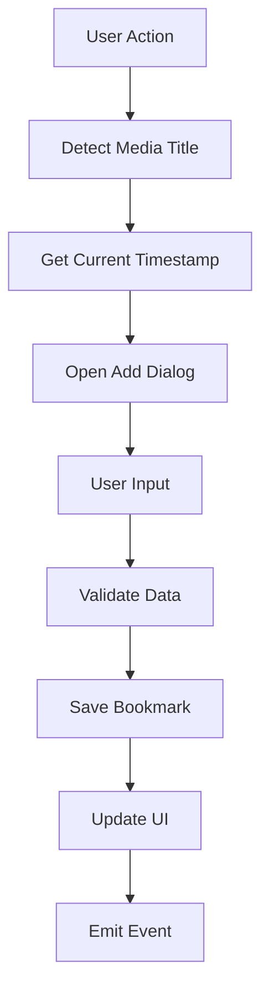
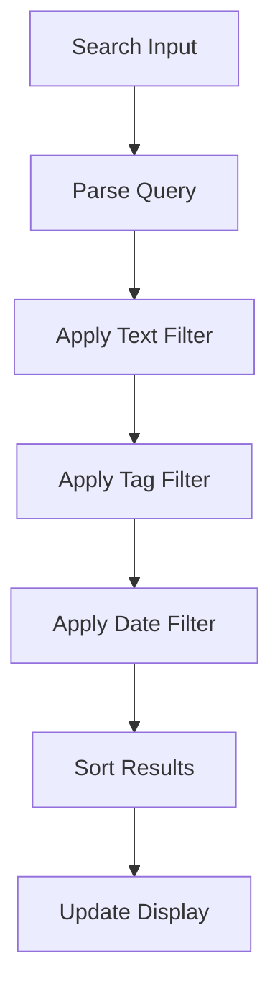

import { Callout } from 'fumadocs-ui/components/callout';

# Architecture

This document outlines the technical architecture and design patterns used in the IINA Plugin Bookmarks project.

## Project Structure

```
iina-plugin-bookmarks/
├── src/                    # TypeScript source code
│   ├── bookmark-manager.ts # Core bookmark management
│   ├── metadata-detector.ts # Media title detection
│   ├── global.ts          # Global types and interfaces
│   └── ui/                # User interface components
├── dist/                  # Compiled JavaScript output
├── tests/                 # Unit and integration tests
├── docs/                  # Fumadocs documentation site
├── .github/               # GitHub workflows and assets
└── assets/               # Plugin assets and resources
```

## Core Components

### BookmarkManager

The central orchestrator for all bookmark operations:

```typescript
class BookmarkManager {
  // Core bookmark operations
  async addBookmark(title?: string, timestamp?: number): Promise<void>
  async removeBookmark(id: string): Promise<void>
  async editBookmark(id: string, updates: Partial<BookmarkData>): Promise<void>
  
  // Data management
  async exportBookmarks(format: ExportFormat): Promise<string>
  async importBookmarks(data: string, format: ImportFormat): Promise<void>
  
  // Search and filtering
  searchBookmarks(query: string): BookmarkData[]
  filterByTags(tags: string[]): BookmarkData[]
}
```

### MetadataDetector

Handles intelligent media title detection:

```typescript
class MetadataDetector {
  async getCurrentTitle(): Promise<string>
  extractTitleFromFilename(path: string): string
  private cleanTitle(title: string): string
  private removeQualityIndicators(title: string): string
}
```

### UI Components

Modular user interface components built with modern web technologies:

- **Plugin Sidebar** - Integrated IINA sidebar component
- **Standalone Window** - Independent bookmark manager window
- **Add Bookmark Dialog** - Modal for creating new bookmarks
- **Settings Panel** - Configuration interface

## Design Patterns

### Dependency Injection

The plugin uses dependency injection for better testability and modularity:

```typescript
interface Dependencies {
  core: IINACore;
  logger: Logger;
  storage: StorageProvider;
}

class BookmarkManager {
  constructor(private deps: Dependencies) {}
}
```

### Observer Pattern

Event-driven updates for UI synchronization:

```typescript
class BookmarkEventEmitter {
  on(event: 'bookmark-added' | 'bookmark-removed', handler: Function): void
  emit(event: string, data: any): void
}
```

### Strategy Pattern

Flexible export/import handling:

```typescript
interface ExportStrategy {
  export(bookmarks: BookmarkData[]): string;
}

class JSONExportStrategy implements ExportStrategy {
  export(bookmarks: BookmarkData[]): string {
    return JSON.stringify(bookmarks, null, 2);
  }
}

class CSVExportStrategy implements ExportStrategy {
  export(bookmarks: BookmarkData[]): string {
    // CSV export implementation
  }
}
```

## Data Flow

### Bookmark Creation Flow



### Search and Filter Flow



## Storage Architecture

### Local Storage

Bookmarks are stored locally using IINA's plugin storage system:

```typescript
interface BookmarkData {
  id: string;
  title: string;
  timestamp: number;
  filePath: string;
  description?: string;
  tags: string[];
  createdAt: Date;
  updatedAt: Date;
}
```

### Backup System

Automatic backup rotation for data safety:

- **Auto-save** - Immediate persistence of changes
- **Backup rotation** - Multiple timestamped backups
- **Recovery system** - Restore from backup functionality

## Error Handling

### Graceful Degradation

The plugin is designed to handle errors gracefully:

```typescript
try {
  const title = await this.metadataDetector.getCurrentTitle();
} catch (error) {
  this.logger.error('Title detection failed', error);
  // Fallback to generic title
  const title = 'Unknown Media';
}
```

### User Feedback

Comprehensive error reporting and user notifications:

- **Toast notifications** for quick feedback
- **Error dialogs** for critical issues
- **Logging system** for debugging
- **Retry mechanisms** for transient failures

## Performance Considerations

### Lazy Loading

UI components are loaded on-demand:

```typescript
const StandaloneWindow = lazy(() => import('./ui/StandaloneWindow'));
```

### Debounced Operations

Search and filter operations are debounced to prevent excessive processing:

```typescript
const debouncedSearch = debounce((query: string) => {
  this.performSearch(query);
}, 300);
```

### Memory Management

Efficient handling of large bookmark collections:

- **Virtual scrolling** for large lists
- **Pagination** for export operations
- **Cleanup routines** for unused resources

## Testing Strategy

### Unit Tests

Individual component testing with Vitest:

```typescript
describe('MetadataDetector', () => {
  it('should extract title from filename', () => {
    const detector = new MetadataDetector(mockDeps);
    const title = detector.extractTitleFromFilename('Movie.2023.1080p.mp4');
    expect(title).toBe('Movie');
  });
});
```

### Integration Tests

End-to-end workflow testing:

```typescript
describe('Bookmark Workflow', () => {
  it('should create, edit, and delete bookmark', async () => {
    const manager = new BookmarkManager(mockDeps);
    await manager.addBookmark('Test Movie', 100);
    // Test complete workflow
  });
});
```

## Security Considerations

### Input Validation

All user inputs are validated and sanitized:

```typescript
function validateBookmarkData(data: Partial<BookmarkData>): BookmarkData {
  return {
    title: sanitizeString(data.title || ''),
    timestamp: Math.max(0, data.timestamp || 0),
    tags: (data.tags || []).map(sanitizeString),
    // ... other validations
  };
}
```

### File System Access

Secure handling of file paths and media access:

- **Path validation** to prevent directory traversal
- **Permission checks** before file operations
- **Sandboxed execution** within IINA's security model

<Callout type="info">
  The plugin operates within IINA's security sandbox and follows all platform security guidelines.
</Callout>

## Future Architecture Improvements

### Planned Enhancements

- **Plugin ecosystem** support for extensions
- **Cloud sync** capabilities for cross-device bookmarks
- **API layer** for third-party integrations
- **Machine learning** for smart tagging and recommendations

### Scalability Considerations

- **Database migration** for large bookmark collections
- **Microservice architecture** for advanced features
- **Caching strategies** for improved performance
- **Progressive loading** for better user experience 