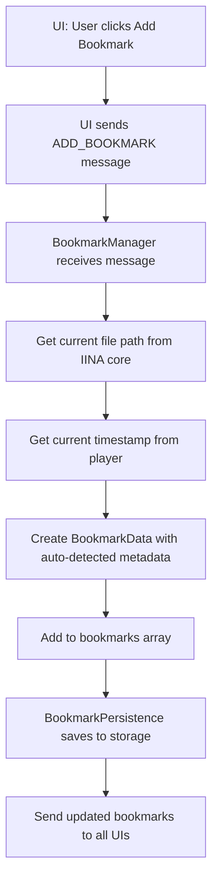
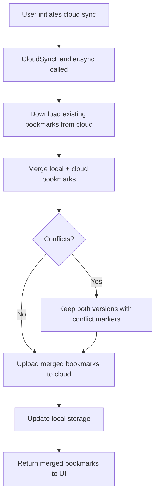
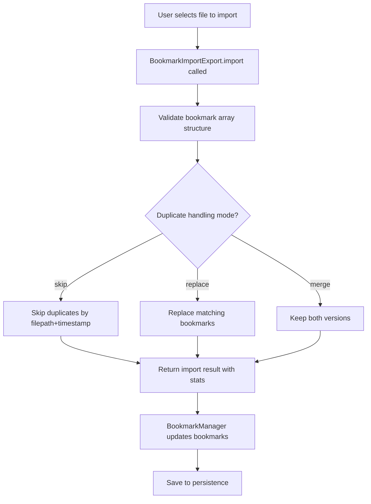

import { Callout } from 'fumadocs-ui/components/callout';

# Architecture

This document outlines the technical architecture and design patterns used in the IINA Plugin Bookmarks project.

## Project Structure

```
iina-plugin-bookmarks/
├── src/
│   ├── index.ts              # Plugin entry point
│   ├── bookmark-manager.ts   # Core bookmark management (unified orchestrator)
│   ├── bookmark-import-export.ts # Import/export functionality
│   ├── bookmark-persistence.ts   # Storage/persistence layer
│   ├── cloud-storage.ts      # Cloud storage provider
│   ├── cloud-sync-handler.ts # Cloud sync orchestration
│   ├── types.ts              # TypeScript type definitions
│   └── utils/                # Utility functions
│       ├── formatTime.ts     # Time formatting helpers
│       └── validation.ts     # Input validation and sanitization
├── ui/
│   ├── sidebar/              # IINA sidebar UI
│   │   ├── index.html
│   │   ├── index.tsx
│   │   └── app.tsx
│   ├── overlay/              # Media overlay UI
│   │   ├── index.html
│   │   ├── index.tsx
│   │   └── app.tsx
│   ├── window/               # Standalone window UI
│   │   ├── index.html
│   │   ├── index.tsx
│   │   └── app.tsx
│   ├── components/           # Shared React components
│   ├── hooks/                # Custom React hooks
│   ├── utils/                # UI utility functions
│   ├── types.ts              # UI-specific types
│   └── shared.scss           # Shared styles
├── tests/                    # Vitest test suites
├── docs/                     # Fumadocs documentation site
└── ...config files           # ESLint, TypeScript, Parcel, etc.
```

## Core Components

### BookmarkManager

The central orchestrator that coordinates all bookmark operations and manages communication between components:

```typescript
class BookmarkManager {
  private bookmarks: BookmarkData[];
  private persistence: BookmarkPersistence;
  private importExport: BookmarkImportExport;
  private cloudSync: CloudSyncHandler;

  constructor(dependencies: IINARuntimeDependencies)

  // Bookmark operations
  addBookmark(title?: string, timestamp?: number, filepath?: string): void
  deleteBookmark(id: string): void
  updateBookmark(id: string, updates: BookmarkUpdatableFields): void
  jumpToBookmark(id: string): void

  // Data management
  exportBookmarks(format: 'json' | 'csv'): string
  importBookmarks(data: BookmarkData[], options: ImportOptions): ImportResult

  // Cloud sync
  syncToCloud(provider: 'google-drive' | 'dropbox', credentials: CloudCredentials): Promise<void>

  // UI management
  private setupWebUI(): void
  private handleUIMessage(message: UIMessage, source: UISource): void
}
```

### BookmarkPersistence

Handles local storage with automatic backup:

```typescript
class BookmarkPersistence {
  load(): BookmarkData[]
  save(bookmarks: BookmarkData[]): void
  recoverFromBackup(): BookmarkData[]
}
```

### BookmarkImportExport

Manages import/export functionality with validation:

```typescript
class BookmarkImportExport {
  import(existing: BookmarkData[], raw: unknown[], options?: ImportOptions): ImportResult
  exportJSON(bookmarks: BookmarkData[]): string
  exportCSV(bookmarks: BookmarkData[]): string
}
```

### CloudSyncHandler

Orchestrates cloud synchronization with conflict resolution:

```typescript
class CloudSyncHandler {
  sync(provider: CloudStorageManager, bookmarks: BookmarkData[]): Promise<BookmarkData[]>
  upload(provider: CloudStorageManager, bookmarks: BookmarkData[]): Promise<void>
  download(provider: CloudStorageManager): Promise<BookmarkData[]>
}
```

### UI Components

Three distinct interface modes built with React:

- **Sidebar** (`ui/sidebar/`) - Full bookmark manager integrated into IINA sidebar with filters, search, and all dialogs
- **Overlay** (`ui/overlay/`) - Lightweight overlay with search and quick jump functionality
- **Window** (`ui/window/`) - Standalone window with complete editing capabilities

Shared components include:
- `AddBookmarkDialog` - Create new bookmarks
- `ImportDialog` / `ExportDialog` - Data import/export
- `CloudSyncDialog` - Cloud provider authentication
- `FilterComponent` / `AdvancedSearch` - Filtering and search
- `FileReconciliationDialog` - Handle file path conflicts

## Design Patterns

### Dependency Injection

The plugin uses dependency injection through the `IINARuntimeDependencies` interface:

```typescript
interface IINARuntimeDependencies {
  core: IINACore;           // Media playback control
  event: IINAEventBus;      // Event system
  preferences: IINAPreferences; // Persistent storage
  menu: IINAMenu;           // Menu integration
  overlay: IINAUIAPI;       // Overlay UI
  sidebar: IINAUIAPI;       // Sidebar UI
  standaloneWindow: IINAUIAPI; // Window UI
  http: IINAHttp;           // Network requests
  console: IINAConsole;     // Logging
}

class BookmarkManager {
  constructor(dependencies: IINARuntimeDependencies) {
    this.deps = dependencies;
    // Inject dependencies into sub-components
    this.persistence = new BookmarkPersistence(dependencies.preferences, dependencies.console);
    this.importExport = new BookmarkImportExport(dependencies.console);
    // ...
  }
}
```

### Message-Based Communication

UI components communicate with the plugin backend via structured messages:

```typescript
type UIMessage = {
  type: 'ADD_BOOKMARK' | 'DELETE_BOOKMARK' | 'JUMP_TO_BOOKMARK' | /* ... */;
  payload: Record<string, unknown>;
};

private handleUIMessage(message: UIMessage, source: UISource): void {
  switch (message.type) {
    case 'ADD_BOOKMARK':
      this.addBookmark(/* ... */);
      break;
    // ...
  }
}
```

### Separation of Concerns

Each module has a single, well-defined responsibility:

- **BookmarkManager** - Orchestration and UI communication
- **BookmarkPersistence** - Local storage operations
- **BookmarkImportExport** - Data transformation
- **CloudSyncHandler** - Cloud synchronization logic
- **CloudStorage** - Provider-specific implementations (Google Drive, Dropbox)

## Data Flow

### Bookmark Creation Flow



### Cloud Sync Flow



### Import Flow



## Storage Architecture

### Local Storage

Bookmarks are stored locally using IINA's plugin storage system:

```typescript
interface BookmarkData {
  id: string;
  title: string;
  timestamp: number;
  filePath: string;
  description?: string;
  tags: string[];
  createdAt: Date;
  updatedAt: Date;
}
```

### Backup System

Automatic backup rotation for data safety:

- **Auto-save** - Immediate persistence of changes
- **Backup rotation** - Multiple timestamped backups
- **Recovery system** - Restore from backup functionality

## Error Handling

### Input Validation

All user inputs are validated and sanitized:

```typescript
// Strip HTML tags to prevent injection
import { stripHtmlTags } from './utils/validation';

const sanitizedTitle = stripHtmlTags(userInput);

// Validate bookmark array structure
const validated = validateBookmarkArray(rawBookmarks, console);
```

### CSV Formula Injection Prevention

Export operations protect against CSV formula injection:

```typescript
function sanitizeCsvCell(value: string): string {
  if (/^[=+\-@\t\r]/.test(value)) {
    return "'" + value; // Prefix dangerous characters
  }
  return value;
}
```

### Backup and Recovery

Automatic backup system for data safety:

```typescript
class BookmarkPersistence {
  save(bookmarks: BookmarkData[]): void {
    // Save to backup key before overwriting
    preferences.set('bookmarks_backup', JSON.stringify(bookmarks));
    preferences.set('bookmarks', JSON.stringify(bookmarks));
  }

  recoverFromBackup(): BookmarkData[] {
    // Restore from backup if main storage is corrupted
    return JSON.parse(preferences.get('bookmarks_backup') || '[]');
  }
}
```

### User Feedback

The UI provides comprehensive feedback:

- **Toast notifications** - Success/error messages
- **Error boundaries** - Graceful UI error handling (React)
- **Console logging** - Debug information via IINA console
- **Reconciliation dialogs** - Handle missing file paths

## Performance Considerations

### Debounced Search

Search operations use custom debounce hook to prevent excessive re-renders:

```typescript
// ui/hooks/useDebounce.ts
const debouncedSearchTerm = useDebounce(searchTerm, 300);
```

### Concurrency Control

Cloud sync operations include timeout protection:

```typescript
class CloudSyncHandler {
  private syncInProgress = false;
  private readonly SYNC_TIMEOUT = 60000; // 60 seconds

  async sync(/* ... */): Promise<BookmarkData[]> {
    if (this.syncInProgress) {
      throw new Error('Sync already in progress');
    }
    // Implement timeout guard...
  }
}
```

### Memory Efficient Storage

Bookmarks are stored as JSON strings and parsed on demand:

```typescript
// Only parse when needed
const bookmarks = JSON.parse(preferences.get('bookmarks') || '[]');
```

## Testing Strategy

### Unit Tests

Component testing with Vitest and comprehensive mocking:

```typescript
describe('BookmarkImportExport', () => {
  it('should skip duplicates when importing', () => {
    const existing = [{ id: '1', filepath: '/test.mp4', timestamp: 100, /* ... */ }];
    const toImport = [{ filepath: '/test.mp4', timestamp: 100, /* ... */ }];

    const result = importExport.import(existing, toImport, {
      duplicateHandling: 'skip'
    });

    expect(result.imported).toBe(0);
    expect(result.skipped).toBe(1);
  });
});
```

### Integration Tests

End-to-end workflow testing with mocked IINA APIs:

```typescript
describe('Cloud Sync Integration', () => {
  it('should merge local and cloud bookmarks', async () => {
    const mockCloudStorage = createMockCloudStorageManager();
    const handler = new CloudSyncHandler(mockCloudStorage, mockConsole);

    const local = [/* local bookmarks */];
    const merged = await handler.sync(mockCloudStorage, local);

    expect(merged.length).toBeGreaterThan(local.length);
  });
});
```

### UI Component Tests

React component testing with React Testing Library:

```typescript
describe('ErrorBoundary', () => {
  it('should catch errors and display fallback UI', () => {
    const ThrowError = () => { throw new Error('Test error'); };

    render(
      <ErrorBoundary>
        <ThrowError />
      </ErrorBoundary>
    );

    expect(screen.getByText(/something went wrong/i)).toBeInTheDocument();
  });
});
```

## Security Considerations

### Input Sanitization

All user inputs are sanitized to prevent injection attacks:

```typescript
import { stripHtmlTags } from './utils/validation';

// Strip HTML/script tags from all user-provided strings
const sanitized = {
  title: stripHtmlTags(userInput.title),
  description: userInput.description ? stripHtmlTags(userInput.description) : undefined,
  tags: userInput.tags.map(stripHtmlTags)
};
```

### CSV Formula Injection Prevention

CSV exports protect against formula injection:

```typescript
// Prefix dangerous characters with single quote
function sanitizeCsvCell(value: string): string {
  if (/^[=+\-@\t\r]/.test(value)) {
    return "'" + value;
  }
  return value;
}
```

### IINA Security Sandbox

The plugin operates within IINA's security model:

- **Permissions** - Network access requires `"network-request"` permission in Info.json
- **File access** - Limited to media files opened in IINA
- **Storage** - Isolated plugin preferences storage
- **Network** - HTTPS-only cloud connections

<Callout type="info">
  The plugin follows IINA's security guidelines and operates within its sandboxed environment.
</Callout>

## Technology Stack

### Backend (JavaScriptCore Runtime)

- **TypeScript 5.8** - Type-safe development
- **ES2019 target** - Compatible with IINA's JavaScriptCore engine
- **No DOM APIs** - Backend runs in non-browser environment
- **Parcel 2.16** - Module bundling and compilation

### Frontend (WKWebView)

- **React 19** - UI component framework
- **TypeScript** - Type safety
- **SCSS** - Styling with variables and nesting
- **Parcel** - Build system with `parcel-optimizer-webview`

### Testing

- **Vitest 4.x** - Fast unit testing framework
- **React Testing Library** - Component testing utilities
- **Mock IINA APIs** - Comprehensive test doubles

### Development Tools

- **pnpm** - Fast, disk-efficient package manager
- **ESLint 9** - Flat config linting
- **Prettier 3** - Code formatting
- **Husky v9** - Git hooks for quality gates