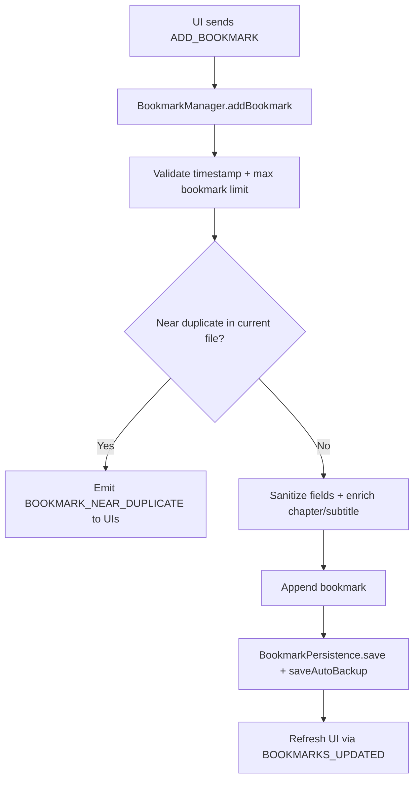
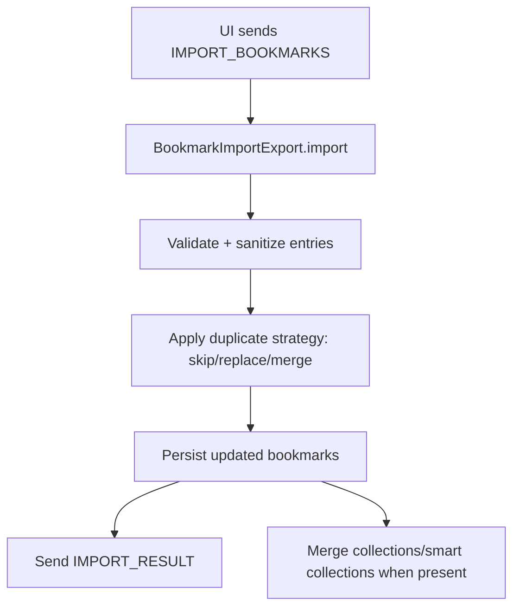

import { Callout } from 'fumadocs-ui/components/callout';

# Architecture

This document summarizes the current runtime architecture in `src/` and the UI messaging contract used by the plugin.

## Project Structure

```text
iina-plugin-bookmarks/
├── src/
│   ├── index.ts                 # Plugin entry point
│   ├── bookmark-manager.ts      # Core orchestrator for bookmark + UI workflows
│   ├── bookmark-import-export.ts # Import/export parser + serializers
│   ├── bookmark-persistence.ts  # Preferences storage + backup logic
│   ├── thumbnail-generator.ts   # FFmpeg thumbnail generation helper
│   ├── types.ts                 # Shared runtime types + message payload maps
│   └── utils/
│       ├── formatTime.ts        # Time formatting helpers
│       └── validation.ts        # Input validation/sanitization helpers
├── ui/
│   ├── sidebar/                 # Sidebar React app
│   ├── overlay/                 # Overlay React app
│   ├── window/                  # Standalone window React app
│   ├── components/              # Shared UI components
│   ├── hooks/                   # Shared hooks
│   └── types.ts                 # UI-side types
├── tests/                       # Vitest test suites
└── docs/                        # Fumadocs site
```

## Core Components

### BookmarkManager

`BookmarkManager` is the central coordinator for bookmarks, collections, playback integration, and UI messaging.

```typescript
class BookmarkManager {
  private bookmarks: BookmarkData[];
  private collections: BookmarkCollection[];
  private smartCollections: SmartCollection[];
  private persistence: BookmarkPersistence;
  private importExport: BookmarkImportExport;
  private thumbnailGenerator: ThumbnailGenerator;

  constructor(dependencies: IINARuntimeDependencies)

  async addBookmark(...): Promise<string | undefined>
  removeBookmark(id: string): void
  updateBookmark(id: string, data: BookmarkUpdatableFields): void
  jumpToBookmark(id: string): void

  createCollection(name: string, ...): void
  createSmartCollection(name: string, ...): void
  batchDelete(ids: string[]): void
  setABLoop(bookmarkId: string): void
  clearABLoop(): void
}
```

### BookmarkPersistence

Persists bookmarks in preferences, keeps a shadow backup, and can recover after parse/storage failures.

```typescript
class BookmarkPersistence {
  load(): BookmarkData[];
  save(bookmarks: BookmarkData[]): void;
  saveAutoBackup(bookmarks: BookmarkData[]): void;
  recover(): BookmarkData[] | null;
}
```

### BookmarkImportExport

Validates import input, enforces caps, and supports v1/v2 JSON export formats plus CSV export.

```typescript
class BookmarkImportExport {
  import(
    existing: BookmarkData[],
    raw: unknown[],
    options?: ImportOptions,
  ): {
    bookmarks: BookmarkData[];
    result: ImportResult;
  };
  exportJSON(bookmarks: BookmarkData[]): string;
  exportJSONv2(
    bookmarks: BookmarkData[],
    collections: BookmarkCollection[],
    smartCollections: SmartCollection[],
  ): string;
  exportCSV(bookmarks: BookmarkData[]): string;
}
```

### ThumbnailGenerator

Generates bookmark thumbnails on demand via `ffmpeg` when `iina.utils.exec` is available.

```typescript
class ThumbnailGenerator {
  generate(bookmark: BookmarkData): string | null;
}
```

## Design Patterns

### Dependency Injection

The plugin is initialized with `IINARuntimeDependencies` from `src/types.ts`:

```typescript
interface IINARuntimeDependencies {
  console: IINAConsole;
  core: IINACore;
  preferences: IINAPreferences;
  menu: IINAMenu;
  event: IINAEvent;
  sidebar: IINASidebar;
  overlay: IINAOverlay;
  standaloneWindow: IINAStandaloneWindow;
  utils: IINAUtils;
  file: IINAFile;
  mpv?: IINAMpv;
  playlist?: IINAPlaylist;
}
```

### Message-Based UI Communication

Backend and UI communicate through named messages with typed payload maps in `src/types.ts`.

```typescript
// UI -> Backend (examples)
ADD_BOOKMARK: { title?: string; timestamp?: number; description?: string; tags?: string[]; color?: BookmarkColor; endTimestamp?: number }
UPDATE_BOOKMARK: { id: string; data: BookmarkUpdatableFields }
CREATE_COLLECTION: { name: string; description?: string; color?: BookmarkColor; icon?: string }
REQUEST_THUMBNAIL: { bookmarkId: string }
SEEK_TO_TIMESTAMP: { timestamp: number }

// Backend -> UI (examples)
BOOKMARKS_UPDATED: BookmarkData[]
COLLECTIONS_UPDATED: BookmarkCollection[]
SMART_COLLECTIONS_UPDATED: SmartCollection[]
BOOKMARK_NEAR_DUPLICATE: { existingBookmark: BookmarkData; proposedTimestamp: number; distance: number }
THUMBNAIL_READY: { bookmarkId: string; path: string }
ERROR: { message: string }
```

### Separation of Concerns

- **BookmarkManager**: orchestration + message routing + playback/menu integration
- **BookmarkPersistence**: storage + recovery + backup writes
- **BookmarkImportExport**: import/export transforms and validation boundaries
- **ThumbnailGenerator**: FFmpeg thumbnail capture
- **Validation utils**: centralized sanitization and guardrails

## Data Flow

### Bookmark Creation Flow


```mermaid
graph TD
    A[UI sends ADD_BOOKMARK] --> B[BookmarkManager.addBookmark]
    B --> C[Validate timestamp + max bookmark limit]
    C --> D{Near duplicate in current file?}
    D -->|Yes| E[Emit BOOKMARK_NEAR_DUPLICATE to UIs]
    D -->|No| F[Sanitize fields + enrich chapter/subtitle]
    F --> G[Append bookmark]
    G --> H[BookmarkPersistence.save + saveAutoBackup]
    H --> I[Refresh UI via BOOKMARKS_UPDATED]
```

### Import Flow


```mermaid
graph TD
    A[UI sends IMPORT_BOOKMARKS] --> B[BookmarkImportExport.import]
    B --> C[Validate + sanitize entries]
    C --> D[Apply duplicate strategy: skip/replace/merge]
    D --> E[Persist updated bookmarks]
    E --> F[Send IMPORT_RESULT]
    E --> G[Merge collections/smart collections when present]
```

## Storage Architecture

### Bookmark Model

```typescript
interface BookmarkData {
  id: string;
  title: string;
  timestamp: number;
  filepath: string;
  description?: string;
  createdAt: string;
  updatedAt: string;
  tags: string[];
  color?: BookmarkColor;
  endTimestamp?: number;
  pinned?: boolean;
  thumbnailPath?: string;
  chapterTitle?: string;
  subtitleText?: string;
  scratchpad?: boolean;
}
```

### Collection Models

```typescript
interface BookmarkCollection {
  id: string;
  name: string;
  description?: string;
  bookmarkIds: string[];
  color?: BookmarkColor;
  icon?: string;
  createdAt: string;
  updatedAt: string;
}

interface SmartCollection {
  id: string;
  name: string;
  description?: string;
  filters: SmartCollectionFilters;
  color?: BookmarkColor;
  icon?: string;
  createdAt: string;
  usageCount: number;
  builtin?: boolean;
}
```

### Backup Behavior

- Main data: `preferences['bookmarks']`
- Shadow backup: `preferences['bookmarks_backup']` before writes
- Debounced file backup: `@data/bookmarks-backup.json` (best-effort)

## Error Handling & Security

- User-provided strings are sanitized with `stripHtmlTags()`.
- Timestamp and range fields are validated against `MAX_TIMESTAMP` and ordering rules.
- CSV export prefixes dangerous leading characters to prevent formula injection.
- Reconciliation and import paths return explicit result payloads to UI (`FILE_RECONCILIATION_RESULT`, `IMPORT_RESULT`).

## Performance Notes

- Overlay receives server-filtered bookmarks for current file only.
- Sidebar/window receive full lists and do client-side filtering.
- Playback status is broadcast on file load and then every 5 seconds.
- Thumbnail generation is lazy and opt-in (`REQUEST_THUMBNAIL`).

<Callout type="info">
  Cloud sync is not part of the current `src/` runtime. If cloud sync is reintroduced, document it
  as a roadmap item until code ships.
</Callout>
